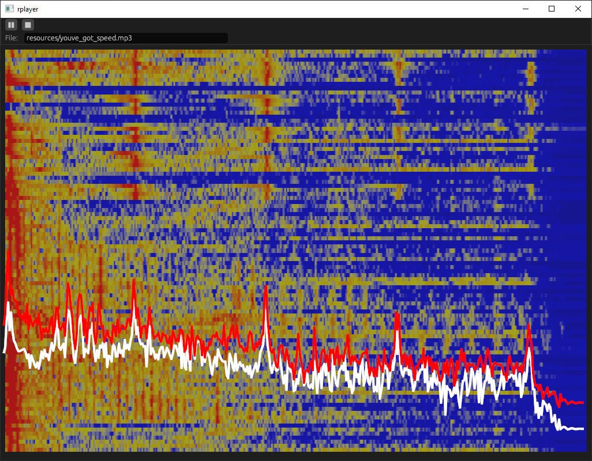

# rplayer

A (very) basic MP3 audio player in rust using gstreamer, rustfft and egui.

Written as an exercise to learn a little more about rust and immediate mode GUI applications.

This application uses the excellent [gstreamer](https://crates.io/crates/gstreamer) crate. 
In order to run it you need to download and install a recent [gstreamer](https://gstreamer.freedesktop.org/) runtime for your OS.
The applciation was developed using gstreamer 1.16.2 but any recent version should be OK.

The spectrum display data is computed with the [rustfft](https://crates.io/crates/rustfft) 
crate which is written in pure rust and is a pleasure to use. 

 

The provided MP3 file is available on Souncloud at [notchism](https://soundcloud.com/notchism)